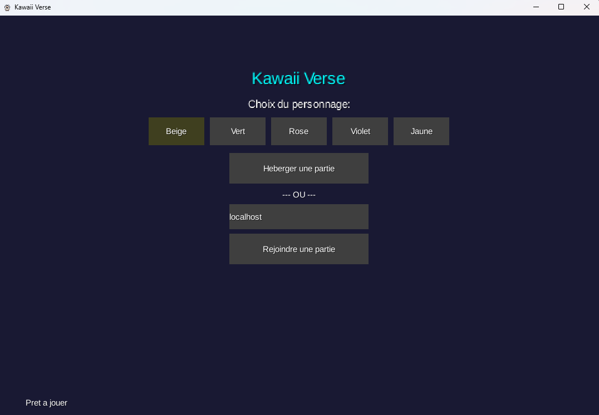
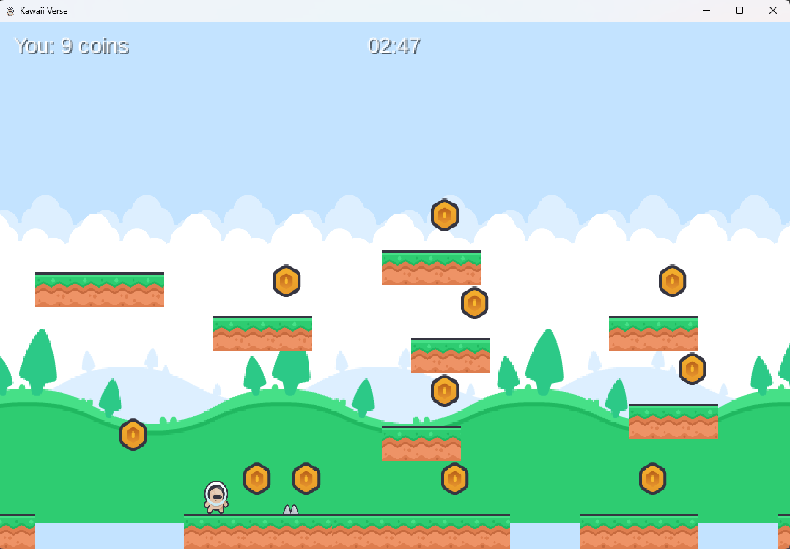
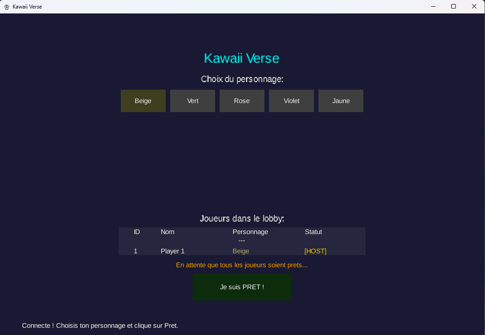

# Kawaii Verse Coop

> Jeu de plateforme 2D multijoueur cooperatif - Java - LibGDX - KryoNet - Reseau Local

---

## Informations Generales

| Champ | Valeur |
|---|---|
| **Nom** | Kawaii Verse Coop |
| **Type** | Platformer 2D Cooperatif (LAN) |
| **Langage** | Java |
| **Framework** | LibGDX 1.14.0 |
| **Reseau** | KryoNet 2.22 (Server Authority) |
| **Joueurs** | 2 joueurs (reseau local) |
| **Resolution** | 1080 x 720 (virtuelle : 800 x 480) |
| **Plateforme** | Windows (executable autonome, Java embarque) |

---

## Presentation

**Kawaii Verse Coop** est un platformer 2D jouable a deux joueurs en reseau local (LAN).
Un joueur heberge la partie depuis son PC, l'autre s'y connecte via l'adresse IP locale.

Le projet a ete developpe pour maitriser en profondeur :
- La physique 2D (gravite, collisions, resolution)
- La synchronisation reseau temps reel
- L'architecture autoritative serveur
- La gestion complete d'un projet jeu video (prototype -> version distribuable)

---

## Captures d'ecran

SCREENSHOT : Ecran du lobby


SCREENSHOT : Gameplay en cours


SCREENSHOT : Ecran du lobby avec les statuts des joueurs


---

## Gameplay

Les deux joueurs doivent cooperer pour traverser le niveau et atteindre le drapeau de fin
avant l'expiration du timer (3 minutes).

### Fonctionnalites

- Mouvement horizontal fluide avec acceleration/deceleration
- Saut avec gravite realiste et controle aerien reduit
- Camera dynamique avec anticipation de direction
- 60+ collectibles (pieces) repartis sur le niveau
- Pieges (spikes) - mort et respawn instantane
- Invincibilite temporaire (2 s) apres chaque respawn
- Drapeau de fin de niveau a atteindre
- Timer synchronise entre tous les joueurs (3 minutes)
- Classement final des scores

### Controles

| Touche | Action |
|---|---|
| Fleche gauche / droite | Deplacement |
| Espace / Fleche haut | Saut |

---

## Multijoueur

### Fonctionnement

1. Le joueur **hote** lance le jeu -> clique sur **"Heberger une partie"**
2. Le joueur **client** clique sur **"Rejoindre"** -> saisit l'IP de l'hote
3. Dans le **lobby**, chaque joueur choisit son personnage
4. Chaque joueur clique sur **"Je suis pret !"**
5. La partie demarre automatiquement quand tous sont prets

### Architecture reseau

- **Modele** : Server Authority (l'hote fait autorite sur la physique et la logique)
- **Transport** : TCP (donnees critiques) + UDP (positions temps reel)
- **Frequence** : mise a jour serveur a 30 Hz, envoi etat a 20 Hz
- **Synchronise** : positions, animations, collectibles, spikes, timer, fin de niveau, respawn

### Types de messages reseau (11)

| Message | Role |
|---|---|
| `PlayerJoinMessage` | Connexion d'un joueur |
| `PlayerLeaveMessage` | Deconnexion |
| `PlayerInputMessage` | Inputs clavier |
| `GameStateMessage` | Positions et velocites |
| `PlatformStateMessage` | Geometrie des plateformes |
| `CollectibleStateMessage` | Etat des pieces |
| `SpikeStateMessage` | Position des pieges |
| `PlayerRespawnMessage` | Respawn d'un joueur |
| `GameTimerMessage` | Timer synchronise |
| `FinishFlagStateMessage` | Fin de niveau |
| `GameStartMessage` | Signal de lancement |

---

## Personnages et Assets

<!-- SCREENSHOT : Les 5 personnages cote a cote ou selecteur de personnage -->
<!--  -->

**5 personnages jouables** : Beige - Green - Pink - Purple - Yellow

Chaque personnage dispose de **5 animations** : idle, marche, saut, chute, course.

**Assets** : [Kenney Pixel Platformer Pack](https://kenney.nl/) (licence CC0)
- 25 animations de personnages
- Background parallaxe multi-couches
- Collectibles animes
- Pieges (spikes)
- Drapeau anime

---

## Architecture

```
core/
+-- entities/
|   +-- Player.java          # Joueur (local et distant)
|   +-- Platform.java
|   +-- Collectible.java
|   +-- Spike.java
|   +-- FinishFlag.java
+-- systems/
|   +-- PhysicsSystem.java
+-- core/
|   +-- LobbyScreen.java
|   +-- GameScreen.java
|   +-- LevelWinScreen.java
|   +-- GameOverScreen.java
+-- network/
|   +-- NetworkManager.java
|   +-- ServerPlayer.java
|   +-- NetworkListener.java
|   +-- messages/            # 11 classes de messages
+-- utils/
    +-- AssetManager.java
    +-- PlayerTextures.java
    +-- Constants.java
```

---

## Constantes cles

| Parametre | Valeur |
|---|---|
| Gravite | -900 unites/s2 |
| Force de saut | 400 |
| Vitesse max | 230 unites/s |
| Largeur du monde | 5 000 unites |
| Invincibilite respawn | 2 secondes |
| Temps limite | 180 secondes |

---

## Lancer le projet (developpement)

### Prerequis

- JDK 17+
- IntelliJ IDEA (recommande)

### Depuis IntelliJ

```
Panneau Gradle -> lwjgl3 -> Tasks -> application -> run
```

### Generer l'executable Windows (.exe autonome)

```
Panneau Gradle -> lwjgl3 -> Tasks -> distribution -> packageWindowsExe
```

Resultat dans `lwjgl3/build/windows-package/KawaiiVerseCoop/` - zippez ce dossier pour distribuer.

---

## Tests effectues

| Scenario | Statut |
|---|---|
| Mouvement et saut | OK |
| Collisions plateformes | OK |
| Mort et respawn | OK |
| Collectibles synchronises | OK |
| Positions joueurs synchronisees | OK |
| Timer synchronise | OK |
| Fin de niveau | OK |
| Retour au lobby et relance | OK |
| Test sur 2 PC en LAN | OK |

---

## Metriques

- ~6 500 lignes de code Java
- ~25 fichiers Java
- 11 types de messages reseau
- ~30 assets graphiques

---

## Objectifs atteints

- Reseau LAN fonctionnel (2 joueurs confirmes)
- Synchronisation temps reel stable
- Gameplay complet (collectibles, pieges, drapeau, timer)
- Architecture modulaire et maintenable
- Lobby avec selection de personnage
- Ecrans de fin (victoire / temps ecoule)
- Executable Windows distribuable (JRE embarque)

---

## Roadmap

### Court terme
- [ ] Sons et musique
- [ ] Second niveau
- [ ] Support 3-4 joueurs

### Moyen terme
- [ ] Plateformes mobiles
- [ ] Checkpoints
- [ ] Menu de selection de niveau

### Long terme
- [ ] Ennemis avec IA
- [ ] Power-ups
- [ ] Editeur de niveaux

---

## Conclusion

**Kawaii Verse Coop** est un projet de platformer cooperatif complet, demontrant la maitrise de la physique 2D, de la synchronisation reseau temps reel et d'une architecture de jeu propre et maintenable.

> Projet jouable, teste en conditions reelles sur reseau local, et distribuable sans installation.

---

## Stack technique

- Java 17
- LibGDX 1.14.0
- KryoNet 2.22
- Gradle 8.x
- jpackage (build Windows)